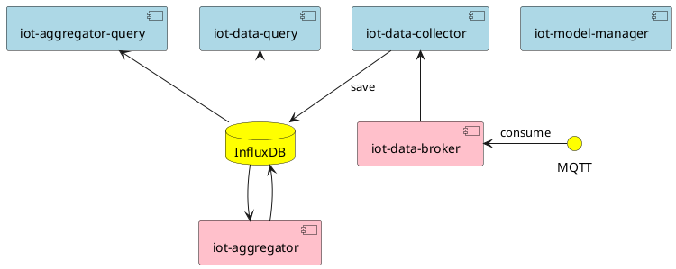

# Light IoT

## Architecture




## Default ports used by Harns

In order to deploy Harns to Edge Container, we use the following ports that refer
to [NodePort port range](https://rancher.com/docs/rancher/v2.x/en/installation/requirements/ports/#commonly-used-ports).

**Important**: There is no dependency on port if Harns is deployed in Kubernetes.

| Service                  | Port  |
| :----------------------- | :---- |
| iot-model-manager        | 32100 |
| iot-data-collector       | 32200 |
| iot-data-query           | 32300 |
| iot-data-broker          | 32400 |
| iot-event-manager        | 32500 |
| iot-rule-manager         | 32600 |
| iot-notification-manager | 32660 |
| iot-installation-manager | 32110 |
| iot-control-manager      | 32130 |

> 32700~32767 are reserved for 3rd applications.

If Harns is deployed via `iotadm`, the port of each service will be assigned by `iotadm`, the default port will not take effect.

## How to Run Swagger UI

Enter the workspace, and then:

```shell
nerdctl run -d -p 8081:8080 \
  -e URLS='[{url: "model-manager.yaml", name: "model-manager"},{url: "data-manager.yaml", name: "data-manager"},{url: "event-manager.yaml", name: "event-manager"},{url: "notification-manager.yaml", name: "notification-manager"},{url: "control-manager.yaml", name: "control-manager"},{url: "data-rollup.yaml", name: "data-rollup"},{url: "rule-manager.yaml", name: "rule-manager"},{url: "installation-manager.yaml", name: "installation-manager"}]' \
  -v ${PWD}/apis/model-manager.yaml:/usr/share/nginx/html/model-manager.yaml \
  -v ${PWD}/apis/data-manager.yaml:/usr/share/nginx/html/data-manager.yaml \
  -v ${PWD}/apis/event-manager.yaml:/usr/share/nginx/html/event-manager.yaml \
  -v ${PWD}/apis/notification-manager.yaml:/usr/share/nginx/html/notification-manager.yaml \
  -v ${PWD}/apis/control-manager.yaml:/usr/share/nginx/html/control-manager.yaml \
  -v ${PWD}/apis/data-rollup.yaml:/usr/share/nginx/html/data-rollup.yaml \
  -v ${PWD}/apis/rule-manager.yaml:/usr/share/nginx/html/rule-manager.yaml \
  -v ${PWD}/apis/installation-manager.yaml:/usr/share/nginx/html/installation-manager.yaml \
  swaggerapi/swagger-ui:v3.47.1
```

Swagger ui image doesn't support mount a folder, so this is a workaround solution. More info refer
to [Not able to run multiple YAML files on swagger-ui #5496](https://github.com/swagger-api/swagger-ui/issues/5496)

## Rule

We port the [Prometheus v2.27.1](https://github.com/prometheus/prometheus/tree/v2.27.1) Promql to support rule engine
expression.

## How to Run Test

Run unit tests

> make test

Run E2E tests

> make test-e2e

